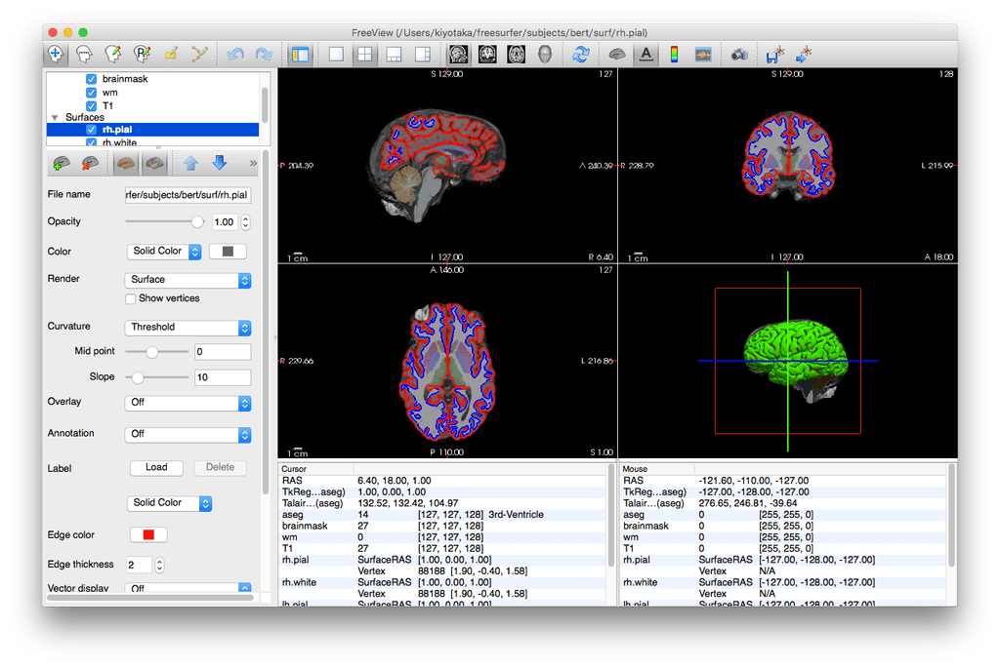

# 第6回ABiS脳画像解析チュートリアル

ここは、2019年3月2-3日に開催予定である **『先端バイオイメージング支援プラットフォーム・FreeSurfer/DeepLearningチュートリアル』** の受講者を対象とした情報提供サイトです。新しい情報があれば、随時このサイトへ追加していきますので、定期的にアクセスするようにして下さい。

## 新着情報

- 2019.02.19: 【重要】subjects の入手方法について記載しました。(3) subjects データの入手をご覧ください。
- 2019.02.19: 第1部(1,2); 第2部(1,2,3) のテキストをアップロードしました。
- 2019.02.18: 3D Slicerのアップデート、FSLのアップデートについての情報を追記しました。
- 2019.01.28: 勉強会用ウェブサイトを立ち上げました。

## 会場案内

- [自然科学研究機構生理学研究所1F大会議室](http://www.nips.ac.jp/)
- [会場までの経路](http://www.nips.ac.jp/profile/access.html) **必ずご参照ください。明大寺地区になります**


## チュートリアル当日のお願い

- 下記の時間帯以外、生理学研究所 実験研究棟の玄関が施錠されます。これらの時間外に、入館を予定されている方は、事務局までご連絡下さい。

    - 3/2 8:00-10:00, 12:00-14:00, 17:00-18:00 
    - 3/3 8:00-10:00, 12:00-14:00, 15:00-17:00

- 当日、生理研のキャンパス内には、**売店を含め食事をする施設がございません。** 昼休みはの時間は短いため、各自、コンビニなどで、当日の昼食を準備してご持参ください。コンビニの場所などは、[こちらの地図](https://github.com/kytk/abis-web/blob/master/pdf/higashiokazaki-map.pdf)を参照してください。

- 生理学研究所 実験研究棟は、全館、土足禁止です。受講者は各自上履き（スリッパなど）、普段靴を入れるビニール袋をご持参ください。

- 開場時間は **08：30** です。

- 会場に到着したら、まず受付をお願いします。


## チュートリアルのスケジュール(予定)

| 日程         | 内容						| 
---- | ----
| 3月2日       |							|
| 08:30 　　　 | 開場					      |
| 09:00-09:10 | 開会						|
| 09:10-10:10 | 第1部(1): FreeSurferの概要/recon-all (筑波大・根本)  |
| 10:20-11:20 | 第1部(2): Freeview/recon-allのQC (根本)	      |
| 11:30-12:30 | 第1部(3): クラスター推測 (佐賀大・川口)	       |
| 12:30-13:30 | -- 昼 食 --					|
| 13:30-14:30 | 第2部(1): Freeviewを用いたFreeSuferのトラブルシューティング (岩手医大・山下) |
| 14:40-15:50 | 第2部(2): 3D Slicerを用いたFreeSuferのQC (山下)	   |
| 16:00-17:10 | 第2部(3): 3D Slicerを用いたFreeSuferのトラブルシューティング (山下)	        |
| 17:10-17:30 | 質疑応答					      |
| 3月3日      | 							|
| 09:00-10:00 | 第3部(1): ROI解析 (根本)			     |
| 10:10-11:10 | 第3部(2): グループ解析 (根本)			  |
| 10:10-11:10 | 第3部(3): スムージング (川口)			  |
| 12:20-13:30 | -- 昼 食 --					|
| 13:30-14:30 | 第4部(1): 深層学習による画像分類・前処理（東京都健康長寿医療センター・下地）|
| 14:40-15:40 | 第4部(2): 深層学習による画像分類・モデル構築（下地）			 |
| 15:40       | 閉会							       |

## パソコンの持参について

- 勉強会では、受講者にPCを持参して頂き、実際に操作しながらコマンドラインについて学んでいきます。PCのスペックについては、以下の **推奨条件** を参考にして下さい
	- Windowsユーザー
		- Windows 7以降 **64bit版**
		- メモリ：8GB以上
		- ハードディスク：100GB以上の空き容量(外付けハードディスクも可)
		- 2ボタン以上のUSBマウス（必須ではありませんが、持っていると便利です）
    
	- Macユーザー
		- macOS 10.11(El Captain)以降
		- メモリ：8GB以上
		- ハードディスク：100GB以上の空き容量(外付けハードディスクも可)
		- 2ボタン以上のUSBマウス（必須ではありませんが、持っていると便利です）
    

## 事前準備

### 想定パターン

今回、以下のパターンを想定しています。
        
- Mac, Winを問わず、VirtualBoxおよびLin4Neuroを準備してチュートリアルに参加する場合

    - チュートリアルは、Lin4Neuro上でターミナルを動かしていきます。
    - 講師と同じ環境を再現したい場合は、Lin4Neuro上で作業することを推奨します。
    - このメリットは、研究室に戻った際に、研究室のワークステーションなどでも同様の環境を簡単に構築できることです。
    - FreeSurfer、DeepLearningの解析ツールが事前にすべて準備されています。

- 自前のMac解析環境またはLinux解析環境でチュートリアルに参加する場合

    - FreeSurfer, git, DeepLearningのためのPythonの各種ライブラリを自前でセットアップ可能なら、自前のMacまたはLinuxで参加いただけます。その場合、事前サポートは限られることをご了承ください。セットアップに自信がない場合は、VirtualBox + Lin4Neuro で参加することをお勧めします。

### (1) Lin4Neuroを使って参加する場合(推奨)
- Lin4Neuro仮想マシンのダウンロード

    - 以下の文書を参考に、ご自分のパソコンに **Lin4Neuro** 環境を作成して下さい。 **なお、第5回ABiSチュートリアルまでに用いられたLin4Neuroと今回のLin4Neuroは構成が異なります。FreeSurferを含め、様々な改訂を行っているため、新規に準備していただくことをおすすめします。容量がない方は過去のものを削除してください。(過去のものと後方互換性はあります)**

        - Macユーザー [VirtualboxへのLin4Neuroのインストール-Mac編-](https://github.com/kytk/abis-web/raw/master/pdf/L4N-abis_on_Mac_Install.pdf)
        - Windowsユーザー [VirtualboxへのLin4Neuroのインストール-Windows編-](https://github.com/kytk/abis-web/raw/master/pdf/L4N-abis_on_Win_Install.pdf)
	
- Slicerのアップデート(2019-02-18 追記)
	- 配布したLin4Neuroに収載されている3D Slicerは Ver.4.10.0 なのですが、このバージョンはFreeSurferのファイルを読み込めないというバグがあることが明らかになりました。よりあたらしい 4.10.1 ではこのバグが修正されています。このパッチを準備しましたので、以下の作業を行ってください。なお、3D SlicerはWindows版、Mac版もありますので、Lin4Neuroではなく、ご自身でWindows版、Mac版をインストールしていただいてもかまいません。

	1. Lin4Neuroのアップデート
	- ターミナルを起動し、以下をタイプします。
	```
	cd git/lin4neuro-bionic
	git pull
	```

	2. Slicerのアップデート
	- デスクトップにある "installer" をダブルクリックし、"3D Slicerのインストールをダブルクリックします。そうすると、ターミナルが起動し、3D Slicer 4.10.1 の圧縮ファイルがダウンロードされます。その後、展開する際にパスワードを尋ねられます。パスワードは、 lin4neuro です。タイプしても表示されませんので、慎重にタイプしてEnterを押してください。

	3. 3D Slicerの起動とバージョン確認
	- メニューの「脳画像解析」から 3D Slicerを起動します。タイトルバーを見て、バージョンが **4.10.1** になっていることを確認してください。

- FSLのアップデート（任意； 2019-02-18 追記）
	- 配布したFSLに搭載されているバージョンは5.0.11であり、インストールが不完全であることが判明しました。今回のFreeSurferチュートリアルではFSLは使用しませんが、以下の方法で最新の6.0.0にすることができます。

	1. Lin4Neuroのアップデート
	- ターミナルを起動し、以下をタイプします。

        ```
        cd git/lin4neuro-bionic
        git pull
        ```

	2. FSLのアップデート
	- デスクトップにある "installer" をダブルクリックし、"FSLのインストール" をダブルクリックします。
        - そうすると、"Do you want to check the update?" と聞かれますので、 yes とタイプしてください。
        - FSL Installer が自動でアップデートされます。
        - Where is the FSL folder ? [/usr/local/fsl]: に対し、そのままEnterを押します。
        - Version 6.0.0 available. Would you like to install update? [yes]: に対してもそのままEnterを押します。
        - Where would you like the FSL install to be? もデフォルトのままEnterでOKです。
        - そうすると、ダウンロードがはじまります。30分〜1時間ぐらいかかりますので、辛抱強くおまちください。
        - ダウンロードが完了すると、FSL esists in the current location, would you like to keep a backup of the old version ? [no] と聞かれます。古いバージョンをとっておく必要はないので、そのままEnterを押してください。
        - すると、パスワードを尋ねられます。 lin4neuro とタイプしてください。パスワードは表示されませんので、注意してタイプしてください。
        - うまく行くと、そのままターミナルが閉じます。
        - その後、Lin4Neuroを再起動してください。
        - ターミナルを起動し、 fsl とタイプして、FSL 6.0.0 が起動することを確認してください。


### (2) 自前のmacOS環境で参加する場合

1. ソフトウェアのインストール

    - ご自身でMacを操作する方は、下記を参考に、FreeSurfer, 3D Slicer と DeepLearningに必要な以下のPythonツールを各自セットアップしてきてください。
	- FreeSurfer: [macOSへのFreeSurfer6.0のインストール](http://www.nemotos.net/?p=1948)
	- [3D Slicer](https://download.slicer.org/)
 

2. GitHubの設定

    - チュートリアルで使うスクリプトなどはGitHub経由で配布します。このため、gitの設定が必要になります。(macOS上でLin4Neuroを動作させる方は、以下の作業は不要です。)

    - gitディレクトリを準備
	- ホームディレクトリの下にgitディレクトリを準備します。
	- ターミナルを立ち上げ、以下をタイプしてください。

            ```
            cd
            mkdir git
            ```

   - チュートリアル用スクリプトのリポジトリをダウンロード
   	- 以下をそのままコピー＆ペーストしてください。

            ```
            cd ~/git
            git clone https://github.com/kytk/abis-201903.git
            ```

	- UsernameとPasswordを聞かれます。受講者メールに記載されているUsernameとPasswordを記載してください。 そうするとダウンロードが始まります。ダウンロードは約5GBありますのでしばらくかかります。

3. パスの設定

    - 過去のFreeSurferチュートリアルに参加された方々

	- 以下のコマンドにより、.bash_profileを開きます。

            ```
            cd
            open -e ~/.bash_profile
            ```

	- "export PATH=$PATH:~/git/abis/fs-scripts" といった文字列がある行を削除し、保存してテキストエディットを閉じてください。


    - 今回のチュートリアル用のパス設定	
	- ターミナルから以下をそのままコピー＆ペーストしてください。タイプする際は、シングルクォーテーションであることに注意してください。ダブルクォーテーションではありません。

            ```
            echo ' ' >> ~/.bash_profile
            echo '#PATH for abis-201903 tutorial' >> ~/.bash_profile
            echo 'export PATH=$PATH:~/git/abis-201903/1-3_freesurfer/fs-scripts' >> ~/.bash_profile
            echo ' ' >> ~/.bash_profile
            ```

	- ちなみに上記のコードは以下の意味です。

            - 空白スペースと改行を .bash_profile に追記しなさい。
            - #PATH for fs-scripts という文字列を .bash_profile に追記しなさい。
            - export PATH=$PATH:~/git/abis-201903/1-3_freesurfer/fs-scripts という文字列を .bash_profile に追記しなさい。 
            - 空白スペースと改行を .bash_profile に追記しなさい。

4. ターミナルを再起動

    - ターミナルを一度閉じ、そのうえでターミナルを再度起動します。

5. プログラムの起動確認

    - ターミナルから以下をタイプしてください。

        ```
        fs_check_6.0.sh
        ```

    - 以下のような画像が得られれば設定が無事に完了しています。



### (3) subjectsデータの入手

- 2月19日以前に abis-201903 フォルダの入手をされた方は、一度削除してください。
    - Windowsの方は、"share" -> "abis-201903" フォルダになります。
    - macOS の方は、 "git" -> "abis-201903" フォルダになります。

- 上記 (1), (2) に従って、再度、abis-201903 のダウンロードを行ってください。データが多くないため、時間はさほどかかりません。

- その後、abis-201903 フォルダに移動し、スクリプトを実行します。

    - Lin4Neuro の方は、ターミナルを起動し、以下をタイプしてください。
      ```
      cd /media/sf_share/abis-201903/1-3_freesurfer
      ./get_subjects.sh
      ```

    - macOSネイティブで FreeSurferチュートリアルを受けれる方は、ターミナルを起動し、以下をタイプしてください。
      ```
      cd ~/git/abis-201903/1-3_freesurfer
      ./get_subjects.sh
      ```

- こちらで、チュートリアルに使用する subjects がダウンロードされます。
- チュートリアル前に必ずこの作業を実行してください。

### プロキシサーバーなどで git clone / pull がうまくいかない場合
プロキシサーバー経由だと git clone / pull がうまくいかない場合があります。
そのような場合は、下記PDFを参考に当日使用するサンプルデータとテキストを入手してください。

- [ABiSチュートリアルデータダウンロード方法](https://github.com/kytk/abis-web/raw/master/pdf/ABiS_Data_GitHub.pdf)
	
## 問い合わせ

準備がうまくいかない時のために、問い合わせフォームを準備しています。こちらからご質問ください。数日以内に担当者から返信させていただきます。

[問い合わせフォーム](https://docs.google.com/forms/d/e/1FAIpQLSc-JX20lvmM3LzSbTKIywtepqwBB-06kVN6AvEFzs-1kcjhHA/viewform?usp=sf_link)


