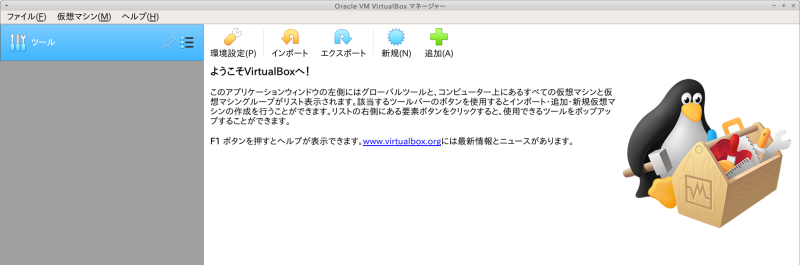
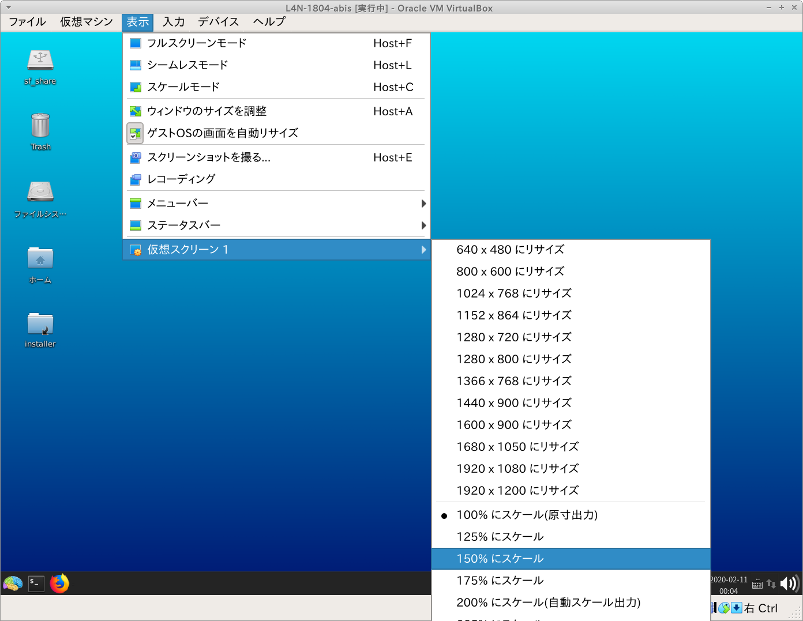
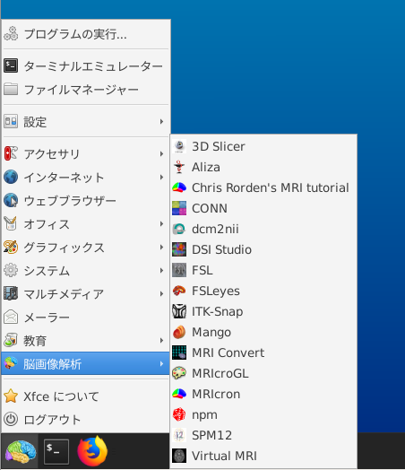

# 第8回ABiS脳画像解析チュートリアル

ここは、2020年12月19-20日に開催予定である **『先端バイオイメージング支援プラットフォーム・FreeSurferチュートリアル』** の受講者を対象とした情報提供サイトです。新しい情報があれば、随時このサイトへ追加していきますので、定期的にアクセスするようにして下さい。

## 新着情報

- 2020.10.17 インストラクションを更新しました。
- 2020.09.26 チュートリアル用ウェブサイトを立ち上げました。

## 会場案内

- 今回はWeb開催となります。
- Zoomの開始時間は、**08：30** です。

## チュートリアルのスケジュール(予定)

| 日程		| 内容 							| 
---- | ----
12月19日 |  
08:30 | Zoomオープン
09:00-09:10 | 開会
09:10-10:10 | 第1部(1): FreeSurferの概要/recon-all (筑波大・根本)
10:20-11:20 | 第1部(2): Freeview/ROI解析 (根本)
11:30-12:30 | -- 昼 食 --
12:30-13:30 | 第2部(1): Freeviewを用いたFreeSuferのトラブルシューティング (岩手医大・山下)
13:40-15:40 | 第2部(2): 3D Slicerを用いたFreeSuferのQC (山下)
15:50-16:50 | 第2部(3): 3D Slicerを用いたFreeSuferのトラブルシューティング (山下)
16:50-17:00 | 質疑応答
12月20日 |  
08:30 | Zoomオープン
09:00-10:00 | 第3部(1): グループ解析(根本)
10:10-11:10 | 第3部(2): 縦断解析 (根本)
11:20-12:20 | 第3部(3): 線形混合モデル (川口)
12:30-13:30 | -- 昼 食 --
13:30-14:30 | 第4部(1): DTIでの実装 (慶応大学・上田)
14:40-15:40 | 第4部(2): FreeSurferの結果を他のソフトで使うための応用 (根本)
15:50-16:00 | 質疑応答
16:00 | 閉会


## パソコンの準備について

- チュートリアルでは、受講者にご自身でPCを準備して頂き、実際に操作しながらコマンドラインについて学んでいきます。PCのスペックについては、以下の **推奨条件** を参考にして下さい

	- OS: Windows10 64bit版 または macOS 10.12.6（Sierra）〜 10.15（Catalina）
	- CPU: Intel Core i7/i9、Intel Core i5（クロック周波数2.0GHz以上）、または AMD Ryzen 5以上の性能を有するもの
	- メモリ：8GB以上 (可能ならば16GB以上を推奨します)
	- ハードディスク：100GB以上の空き容量 (外付けハードディスクも可)
	- 2ボタン以上のUSBマウス (必須ではありませんが、持っていると便利です)
	- 2画面のディスプレイ (自身の作業用とZoomの画面をうつすために2画面を推奨します。2画面が準備できない方は、Zoomの画面をうつすためだけのPCやタブレットを準備してもよいかもしれません)
    
## 事前準備

- チュートリアルに向けて、以下の準備をお願いします。

    A. チュートリアル用Lin4Neuro仮想アプライアンスのダウンロード

    B. VirtualBoxのインストール

    C. VirtualBoxへのLin4Neuroのインポート

    D. 仮想マシンの設定

    E. Lin4Neuroの起動と設定

    F. FreeSurfer用スクリプトのアップデート

    G. チュートリアルテキストの入手

    H. データの入手

    参考. 仮想マシンの削除 (チュートリアル後、不要になった場合)


- 今回は完全オンライン開催ですが、受講者専用サイトに記載されているVirtualBox＋Lin4Neuroの組み合わせで参加することで、過去のチュートリアルと同様にチューターや講師による手厚いサポートが受けることができます。脳画像解析の初心者の方々は受講者専用サイトに記載されている通りに事前準備を行いチュートリアルへ参加することを強く推奨します。
自分自身で基礎的なトラブルシューティングが行える脳画像解析の経験が豊富な中級者以上の方々は、受講者専用サイトに記載されている以外の解析環境（例えば受講者自身が構築した解析環境など）でもチュートリアルに参加可能ですが、原則としてチューターによるサポートの対象外とさせて頂きますので、ご理解、ご協力の程、よろしくお願いします。

- Lin4Neuroは今回のチュートリアルにあわせてアップデートされています。過去のLin4Neuroは使用できませんのでご注意ください。

- ソフトウェアとデータのダウンロードで合計 50GB弱ダウンロードします。Pocket Wi-Fiなどでは確実にパケ死しますので、職場やご自宅のLAN環境から作業してください。


### A. チュートリアル用Lin4Neuro仮想アプライアンスのダウンロード

- 分散ダウンロード(推奨): Lin4Neuroは26GBありますので、分散ダウンロードできるプログラムを準備してあります。自身の環境にあわせて以下の対処を行ってください。Lin4Neuroを30のファイルに分割してダウンロードします。ネットワークの環境にもよりますが、1ファイルあたり3〜5分程度かかりますので、ダウンロード終了に約2〜3時間かかるとお考えください。

    - Windows10

        - [Windows用ダウンローダー](https://github.com/kytk/abis-web/raw/master/util/l4n_win.zip)をダウンロードします。

        - l4n_win.zip を展開します。

        - l4n_win フォルダの中にある `get_L4N_win.bat` をダブルクリックします。

        - 「WindowsによってPCが保護されました」という画面が出ますので、「詳細情報」をクリックします。

        - 右下に「実行」ボタンが出ますので、実行をクリックします。

        - コマンドプロンプトの画面が立ち上がり、aria2cというプログラムによるダウンロードが始まります。

        - ダウンロードが完了すると、L4N-1804-abis-20200927 フォルダの中に L4N-1804-abis-20200927.ova というファイルが生成されます。

        

        

        
 
    - macOS

        - [macOS用ダウンローダー](https://github.com/kytk/abis-web/raw/master/util/l4n_mac.zip)をダウンロードします。

        - l4n_mac.zip を展開します。

        - l4n_mac フォルダの中にある `get_L4N.command` をダブルクリックします。

        - 下図のように「開発元が未確認のため開けません。」と出るので、一度OKを押して、閉じます。

        - 画面左上のAppleメニューから、システム環境設定をクリックし、「セキュリティとプライバシー」をクリックします。

        - 「get_L4N.commandは開発元を確認できないため、使用がブロックされました。」の右側にある「このまま開く」をクリックします。

        - 「開発元を検証できません。開いてもよろしいですか？」に対して、「開く」を選択します。

        - そうすると、ターミナルが起動し、ダウンロードがはじまります。

        - ダウンロードが完了すると、L4N-1804-abis-20200927 フォルダの中に L4N-1804-abis-20200927.ova というファイルが生成されます。

        

        

        

        
 

- 一括ダウンロード: 十分にネットワークが安定している方は、以下からダウンロードしてください。26GBありますのでダウンロードには2〜3時間かかります。ネットワークが細い方は、上の分割ダウンロードを選択してください。

    - [L4N-1804-abis-20200927.ovaのダウンロード](https://www.dropbox.com/t/v64JhpdLBNBeL8ls){:target="_blank"}

    - L4N-1804-abis-20200927.ovaのmd5値は、`e56b531243306d03430749f590066621` になります。ファイルサイズの検証にお使いください。

        - macOSならば、`openssl md5 L4N-1804-abis-20200927.ova` で確認できます。
        - Windowsならば、PowerShellから、`Get-FileHash -Algorithm md5 L4N-1802-abis-20200927.ova` で確認できます。


### B. VirtualBox 6.1 のインストール

チュートリアルでは、VirtualBox 6.1 上で Lin4Neuro を動作させます。最新版の Lin4Neuro は、VirtualBox 6.1で最適化されているため、前のバージョンのVirtualBoxを使用の方は必ず6.1にアップグレードしてください。

- [VirtualBoxのサイト](https://www.virtualbox.org/wiki/Downloads){:target="_blank"} から、ご自身のOSにあったVirtualBoxのインストーラーをダウンロードします。

- ダウンロードしたインストーラーを用いてVirtualBox 6.1 をインストールします。

- インストール後、VirtualBoxを起動します。

    - macOSの場合、VirtualBoxの起動は、ターミナルから起動します。
        
        - Mojave 以前の方と、Catalinaの方で、シェルをデフォルトのzshのまま使っている方は、ターミナルを起動し、`virtualbox` と入力してください。

        - Catalina の方で、シェルをbashに変えている方は、ターミナルを起動し、`zsh -i -c virtualbox` と入力してください。

    

    - macOSでインストールに失敗する場合は、[macOS High Sierra以降で VirtualBox のインストールに失敗する時の最終的な対処法](https://www.nemotos.net/?p=2619){:target="_blank"} を参照ください。

### C. Lin4Neuro仮想アプライアンスのインポート

- ダウンロードした仮想アプライアンスを用いて仮想マシンをインポートします。

- VirtualBoxのメニューから **ファイル** → **仮想アプライアンスのインポート** を選択します。

    

- ファイルに、ダウンロードした **L4N-1804-abis-20200927.ova** を指定し、 **次へ** をクリックします。

    

- 設定画面が出ます。ひとつだけ気をつけていただきたいのが、 **Machine Base Folder** です。このフォルダの下に仮想マシンがインストールされます。必ず、100GB以上あいているところを指定してください(容量が十分にある場合は、デフォルトのままでかまいません)。外部ハードディスクを指定することもできます。SDカードは、速度が異常に遅く実用性に耐えられませんので、使わないでください。

- 設定を確認したうえで、 **インポート** をクリックしてください。
- インポートには10−15分程度かかります。辛抱強くお待ちください。

    

- インポートが終了すると、VirtualBoxのメイン画面に、 **L4N-1804-abis** が表示されます。

    

### D. 仮想マシンの設定

#### 1. 共有フォルダの設定

- 30GB以上あいているところに、Macの方はFinderから、Windowsの方はエクスプローラーから、 **share** というフォルダを作成します。すべて小文字で作成してください。

- あとで確認するため、作成した share フォルダに、何か適当なファイルを入れておいてください。

- VirtualBoxのメイン画面で、L4N-1804-abisをクリックし、選択してから、 **設定** をクリックします。

    

- 設定画面の左側のペインで **共有フォルダー** をクリックしたうえで、画面右側の共有フォルダを追加するアイコンをクリックします。

    

- **フォルダーのパス** の右側の▼から、**その他...** を選択し、先程作成した **share** フォルダを選択します。

- フォルダー名が **share** になっていることを確認します。

- **読み込み専用** と **自動マウント** は**チェックが入っていない**ことを確認してください。

- このうえで、 **OK** をクリックします。

    

#### 2. メモリとCPUの設定

- 次に、設定画面の上から2番め、**システム** をクリックします。

- メインメモリーがデフォルトでは、4096MB、すなわち4GBとなっています。これを、ご自身のPCのメモリに余裕があるならば、増やしてください。Windows/macOSが安定して動くためには、システムに最低4GB(できれば8GB)を与えることは必要です。そのうえで、Lin4Neuroのメモリを増やすことで、動きが改善します。できれば、デスクトップマシンで16GBのメモリを搭載しているならば、仮想マシンに8GB (8192MB)と設定してあげてください。1GB=1024MBです。

    

- 次に、「プロセッサー」のタブをクリックしてください。デスクトップPCでコア数を多く積んでいるPCで動かす場合は、このプロセッサー数を増やしていただくことで、Lin4NeuroでCPUでの並列計算ができるようになります。インジケーターが緑の範囲であれば増やすことは問題ありません。（その分、仮想マシンが動いている場合は、ホストのWindows/macOSで使えるCPUのコア数が減りますのでご了承ください）

    

- これで、設定は終了です。

### E. Lin4Neuroの起動と設定

- VirtualBoxのメイン画面から、 **L4N-1804-abis** を選択したうえで、 **起動** をクリックします。

    

- ログイン画面が立ち上がります。パスワードは **lin4neuro** です。すべて小文字です。

    

#### 1. キーボード設定の確認

- 配布しているLin4Neuroの仮想マシンは日本語キーボードで設定されています。英語キーボードにするには、以下の作業を行ってください。

- メニューから "設定" -> "Fcitx設定" を選択します。

    

- 画面下の矢印を使って、"キーボード - 英語(US)" が一番来るようにして、ウィンドウを閉じます。

    

#### 2. 画面のフォント設定

- VirtualBoxのメニューから "表示" -> "仮想スクリーン" -> "XX%にスケール" を選択してください。適宜見やすい大きさに調整してください。

    

#### 3. 共有フォルダの確認

- 画面左上にある **sf_share** は共有フォルダとして設定したものです。

- sf_share をダブルクリックし、先程試しに入れたファイルが見えることを確認してください。

#### 4. 画像解析ツールの確認

- ログインした後、左下の脳のアイコンをクリックし、 **脳画像解析** をクリックすると、インストールされているソフトウェアを確認できます。

    

#### 5. FreeSurferの確認

FreeSurferのツールはアイコンが準備されていません。以下で確認します。

- 画面左下の脳アイコンの右側にあるターミナルアイコンをクリックし、ターミナルを起動します。

    

- ターミナルに以下をタイプします。間違えないように注意深くタイプしてください。shとbertの間には半角スペースが入ります。

    ```
    fs_view_vol.sh bert
    ```

- 以下のような画面が出れば、FreeSurferがきちんと動作することを確認できます。

    

### F. FreeSurfer用スクリプトのアップデート

- チュートリアルで用いるスクリプトを以下に従って準備してください。

- Lin4Neuroでターミナルを起動します。

- 以下をタイプしてください。

    ```
    cd ~/git/fs-scripts
    git pull
    ```

- チュートリアルの1週間前までスクリプトはアップデートされます。アップデートの案内があった場合には、同様の作業を行ってください。

### G. チュートリアルテキストの入手

- 本チュートリアルで使用するテキストは、GitLabというデータ共有サービスを通して配布します。ここで配布されるものは、チュートリアルの1週間前まで更新される可能性がありますので、こまめに（特に参加直前に）アップデートするようにして下さい。

1. 初めてセットアップする時: ターミナル (Lin4Neuro では、左下のスタートアイコンの隣にあるアイコンから起動できます) から以下を実行して下さい

    ```
    cd /media/sf_share
    メールで示されているコマンドをここにタイプします
    (セキュリティの都合でここには記しません)
    ```

2. 更新する時: ターミナルから以下を実行してください

    ```
    cd /media/sf_share/abis-202012
    git pull
    ```

- こうすると、`/media/sf_share/abis-202012` の下に `textbook` `cheatsheet` というフォルダが生成されます。textbookの中にテキストへのリンクが掲載されています。

#### プロキシサーバーなどを使っている場合

- PCがプロキシサーバを経由して外部ネットワークに接続されている場合は、先にターミナルから以下のコマンドを入力し、Gitに対するプロキシ設定を行って下さい

    ```
    git config --global http.proxy  http://プロキシ名:ポート番号
    git config --global https.proxy http://プロキシ名:ポート番号
    ```

- プロキシ名やポート番号は、所属機関･部署のネットワーク管理者にお尋ね下さい。

- プロキシ設定が不要になった時は、以下のコマンドによって解除できます：

    ```
    git config --global --unset http.proxy
    git config --global --unset https.proxy
    ```

### H. データの入手

- チュートリアルに使うデータは非常に大きいため、GitLabではなく、別にダウンロードしていただきます。

- 上記のテキストの入手を行った後、ターミナルから以下をタイプしてください。

    ```
    cd /media/sf_share/abis-202012
    ./get_data.sh
    ```

- こうすると、`abis-202012` のフォルダの中に `nifti` `subjects` というフォルダができます。

### 参考. 仮想マシンの削除 (チュートリアル後、不要になった場合)

1. 仮想マシンを削除するには、VirtualBoxのメイン画面で、削除したい仮想マシンを選び、右クリックをして、**除去(R)...** を選択します。

    

2. 次にあらわれる画面で、**すべてのファイルを削除** を選択します。

    

## 問い合わせ

- 準備がうまくいかない時のために、問い合わせフォームを準備しています。こちらからご質問ください。数日以内に担当者から返信させていただきます。

- [問い合わせフォーム](https://forms.gle/vMRau1iUaCkvgDQf6){:target="_blank"} 


