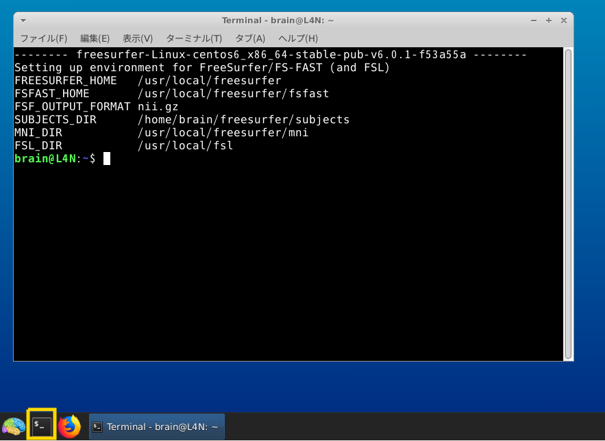
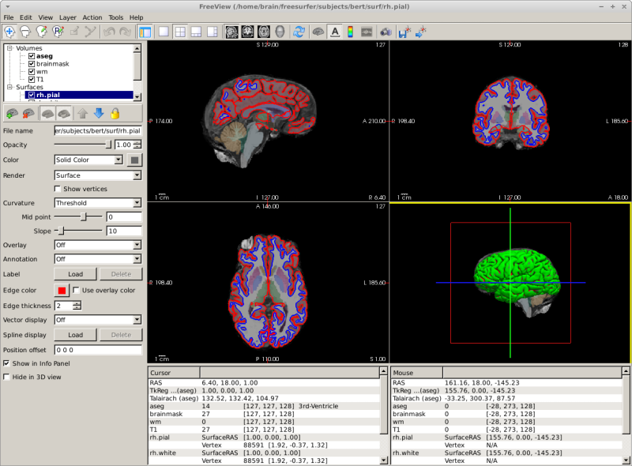

# チュートリアル/勉強会用Lin4Neuroのセットアップ方法（2020年1月）

## PCの推奨環境

- Windowsユーザー
    - CPU
        - Intel: Core i5以上 (Core i3やCeleronでは力不足です）
        - AMD: Ryzen 5以上
    - メモリ: 8GB以上 （4GBでは動作しません）
    - ハードディスク：100GB以上の空き容量(外付けハードディスクも可；その場合、USB3対応が好ましいです)
    - OS: Windows 7以降 64bit版
    - 2ボタン以上のUSBマウス（必須ではありませんが、持っていると便利です）
    
- Macユーザー
    - メモリ：8GB以上 (4GBでは動作しません）
    - ハードディスク：100GB以上の空き容量(外付けハードディスクも可；その場合、USB3対応が好ましいです)
    - OS: macOS 10.11(El Captain)以降
    - 2ボタン以上のUSBマウス（必須ではありませんが、持っていると便利です）

## 想定パターン

今回、以下のパターンを想定しています。

### Mac, Winを問わず、VirtualBoxおよびLin4Neuroを準備してチュートリアルに参加する場合

チュートリアルは、Lin4Neuro上でターミナルを動かしていきます。
講師と同じ環境を再現したい場合は、Lin4Neuro上で作業することを推奨します。メリットは、研究室に戻った際に、研究室のワークステーションなどでも同様の環境を簡単に構築できることです。
解析ツールが事前にすべて準備されています。

### 自前のMac解析環境またはLinux解析環境でチュートリアルに参加する場合

FreeSurfer, FSL, git などのソフトウェアを自前でセットアップ可能なら、自前のMacまたはLinuxで参加いただけます。その場合、事前サポートは限られることをご了承ください。セットアップに自信がない場合は、VirtualBox + Lin4Neuro で参加することをお勧めします。

## VirtualBox上で動作するLin4Neuroで参加する場合

1. VirtualBox 6.1 のインストール

チュートリアルでは、VirtualBox 6.1 上で Lin4Neuro を動作させます。最新版の Lin4Neuro は、VirtualBox 6.1で最適化されているため、前のバージョンのVirtualBoxを使用の方は必ず6.1にアップグレードしてください。

- [VirtualBoxのサイト](https://www.virtualbox.org/wiki/Downloads){:target="_blank"} から、ご自身のOSにあったVirtualBoxのインストーラーをダウンロードします。

- ダウンロードしたインストーラーを用いてVirtualBox 6.1 をインストールします。

- インストール後は以下のような画面になります。


2. Lin4Neuro仮想アプライアンスのダウンロード

Lin4Neuroの仮想アプライアンスを以下からダウンロードします。20GBありますので、十分に容量があるところにダウンロードしてください。

- [L4N-1804-abis-20191218.ovaのダウンロード](http://www.md.tsukuba.ac.jp/clinical-med/psy-neuroimaging/ova/L4N-1804-abis-20191218.ova)

3. Lin4Neuro仮想アプライアンスのインポート

ダウンロードした仮想アプライアンスを用いて仮想マシンをインポートします。

- VirtualBoxのメニューから **ファイル** → **仮想アプライアンスのインポート** を選択します。


- ファイルに、ダウンロードした **L4N-1804-abis-20191218.ova** を指定し、 **次へ** をクリックします。


- 設定画面が出ます。ひとつだけ気をつけていただきたいのが、 **Machine Base Folder** です。このフォルダの下に仮想マシンがインストールされます。必ず、100GB以上あいているところを指定してください(容量が十分にある場合は、デフォルトのままでかまいません)。外部ハードディスクを指定することもできます。SDカードは、速度が異常に遅く実用性に耐えられませんので、使わないでください。

- 設定を確認したうえで、 **インポート** をクリックしてください。
- インポートには10−15分程度かかります。辛抱強くお待ちください。


- インポートが終了すると、VirtualBoxのメイン画面に、 **L4N-1804-abis** が表示されます。


4. 共有フォルダのセットアップ

- 30GB以上あいているところに、Macの方はFinderから、Windowsの方はエクスプローラーから、 **share** というフォルダを作成します。すべて小文字で作成してください。

- あとで確認するため、作成した share フォルダに、何か適当なファイルを入れておいてください。

- VirtualBoxのメイン画面で、L4N-1804-abisをクリックし、選択してから、 **設定** をクリックします。


- 設定画面の左側のペインで **共有フォルダー** をクリックしたうえで、画面右側の共有フォルダを追加するアイコンをクリックします。


- **フォルダーのパス** の右側の▼から、**その他...** を選択し、先程作成した **share** フォルダを選択します。

- フォルダー名が **share** になっていることを確認します。

- **読み込み専用** と **自動マウント** は**チェックが入っていない**ことを確認してください。

- このうえで、 **OK** をクリックします。


- これで、設定は終了です。

5. Lin4Neuroの起動

- VirtualBoxのメイン画面から、 **L4N-1804-abis** を選択したうえで、 **起動** をクリックします。


- ログイン画面が立ち上がります。パスワードは **lin4neuro** です。すべて小文字です。


6. 共有フォルダの確認

- 画面左上にある **sf_share** は共有フォルダとして設定したものです。

- sf_share をダブルクリックし、先程試しに入れたファイルが見えることを確認してください。

7. 画像解析ツールの確認

- ログインした後、左下の脳のアイコンをクリックし、 **脳画像解析** をクリックすると、インストールされているソフトウェアを確認できます。


8. FreeSurferの確認

FreeSurferのツールはアイコンが準備されていません。以下で確認します。

- 画面左下の脳アイコンの右側にあるターミナルアイコンをクリックし、ターミナルを起動します。



- ターミナルに以下をタイプします。間違えないように注意深くタイプしてください。最初はドット（ピリオド）からはじまります。

```./git/lin4neuro-bionic/scripts/fs_check_6.0.sh```

- 以下のような画面が出れば、FreeSurferがきちんと動作することを確認できます。



### 仮想マシンの削除

1. 仮想マシンを削除するには、VirtualBoxのメイン画面で、削除したい仮想マシンを選び、右クリックをして、**除去(R)...** を選択します。


2. 次にあらわれる画面で、**すべてのファイルを削除** を選択します。


## 自前のmacOS環境で参加する場合

1. ソフトウェアのインストール

    - ご自身でMacを操作する方は、FreeSurferを各自セットアップしてきてください。
        - FreeSurfer: [macOSへのFreeSurfer6.0のインストール](http://www.nemotos.net/?p=1948){:target="_blank"} 


