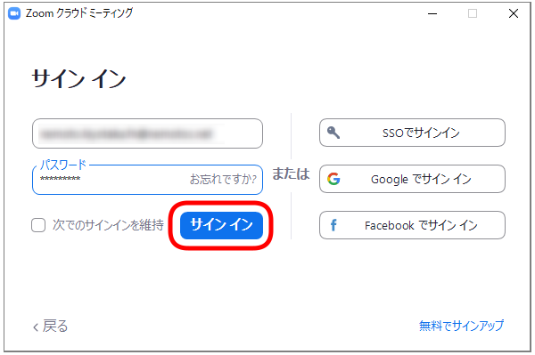
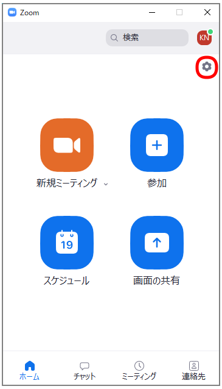
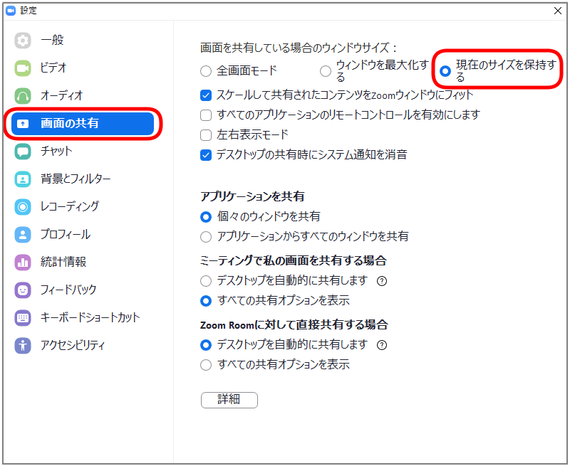

# 第9回ABiSチュートリアルZoomの設定

## Zoomの設定

- チュートリアルはZoomにて開催します
- Zoomは2021年01月19日現在、バージョン5.4.9になっています。5.4.7以降で「手を挙げる」の動作が変更になっておりますので、5.4.7以降で参加してください
    - 以下のリンクをクリックすることで、最新版のZoomを入手できます。(すでにインストールされている方でも以下のリンクからインストーラーを入手することでアップデートできます)
    - Windows: [https://zoom.us/client/latest/ZoomInstaller.exe](https://zoom.us/client/latest/ZoomInstaller.exe)
    - macOS: [https://zoom.us/client/latest/Zoom.pkg](https://zoom.us/client/latest/Zoom.pkg)
- 画面の共有の設定だけ変更すると受講しやすくなります
    - Zoomを起動し、サインインをクリックします

    

    - サインインします

    

    - ホーム画面で右上にある歯車アイコンをクリックします

    

    - 左のメニューから「画面の共有」のタブをクリックし、「画面を共有している場合のウィンドウのサイズ」を「現在のサイズを保持する」に変更します。これにより、講師が画面を共有した場合に、Zoomが全画面モードにならずにすみます

    

    - Zoomの設定は以上で終了です

